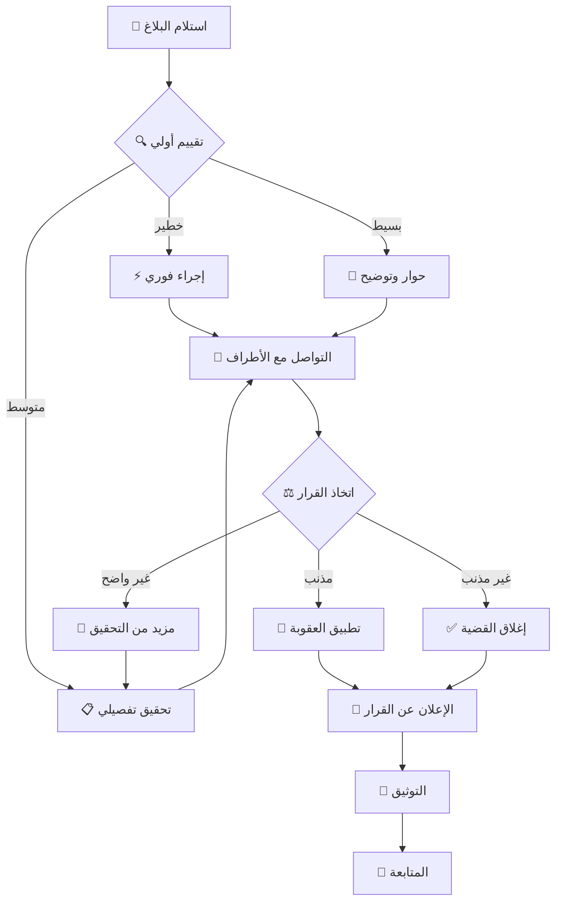

# 🛡️ ميثاق السلوك | Code of Conduct

```
╔═══════════════════════════════════════════════════════════════════╗
║                                                                   ║
║              🎖️  ZAYED SHIELD CODE OF CONDUCT  🇦🇪                ║
║                    ميثاق السلوك - درع زايد                       ║
║                                                                   ║
║        "بالاحترام والتعاون نبني مجتمعاً رقمياً قوياً"           ║
║                                                                   ║
╚═══════════════════════════════════════════════════════════════════╝
```

<div align="center">

**Project:** Zayed Shield | درع زايد  
**Organization:** Central Base | القاعدة المركزية  
**Author:** The Warrior (@asrar-mared)  
**Innovation ID:** pHw-88E-bhb-KL7  
**Version:** 1.0.0  
**Last Updated:** December 1, 2025


</div>

---

## 📋 جدول المحتويات | Table of Contents

- [🎯 تعهدنا](#-تعهدنا--our-pledge)
- [⚔️ قانون شرف المحارب](#️-قانون-شرف-المحارب--warrior-code-of-honor)
- [📐 معاييرنا](#-معاييرنا--our-standards)
- [🤝 مسؤولياتنا](#-مسؤولياتنا--our-responsibilities)
- [🌍 النطاق](#-النطاق--scope)
- [⚖️ التنفيذ](#️-التنفيذ--enforcement)
- [📞 الإبلاغ](#-الإبلاغ--reporting)
- [🔍 عملية المراجعة](#-عملية-المراجعة--review-process)
- [⚡ العواقب](#-العواقب--consequences)
- [📚 الإسناد](#-الإسناد--attribution)

---

## 🎯 تعهدنا | Our Pledge

<div align="center">

### 🤝 **عهد المحاربين الرقميين**

</div>

نحن كأعضاء ومساهمين وقادة في **درع زايد**، نتعهد بجعل المشاركة في مجتمعنا تجربة **خالية من المضايقات** للجميع، بغض النظر عن:

<table>
<tr>
<td width="50%">

### 🌍 الشمولية والتنوع

- 🧑 العمر
- 📏 حجم الجسم
- ♿ الإعاقة (ظاهرة أو غير ظاهرة)
- 🌈 الهوية والتعبير الجنسي
- 🎓 مستوى الخبرة
- 📚 التعليم
- 🏢 الوضع الاجتماعي والاقتصادي

</td>
<td width="50%">

### 🤝 المساواة الكاملة

- 🌍 الجنسية
- 👤 المظهر الشخصي
- 🎭 العرق والإثنية
- 🙏 الدين
- 💑 الهوية والتوجه الجنسي
- 🗣️ اللغة
- 💭 الآراء السياسية

</td>
</tr>
</table>

نتعهد بالتصرف والتفاعل بطرق تساهم في **مجتمع منفتح ومرحب ومتنوع وشامل وصحي**.

---

## ⚔️ قانون شرف المحارب | Warrior Code of Honor

<div align="center">

```ascii
╔═══════════════════════════════════════════════════════════════════╗
║                                                                   ║
║                 🎖️  THE WARRIOR'S CODE  🎖️                       ║
║                     قانون شرف المحارب                            ║
║                                                                   ║
║  1️⃣  الشرف فوق كل شيء                Honor Above All           ║
║  2️⃣  الاحترام للجميع                Respect for All            ║
║  3️⃣  القوة في الوحدة                Strength in Unity          ║
║  4️⃣  المعرفة للجميع                 Knowledge for All          ║
║  5️⃣  الحماية واجب                   Protection is Duty         ║
║  6️⃣  الأمانة والصدق                 Honesty & Integrity        ║
║  7️⃣  التعاون البنّاء                Constructive Collaboration ║
║  8️⃣  العدالة والإنصاف               Justice & Fairness         ║
║                                                                   ║
╚═══════════════════════════════════════════════════════════════════╝
```

</div>

### 🎖️ مبادئ المحارب الرقمي

كمحارب رقمي في **درع زايد**، أتعهد بـ:

1. **الشرف** 🎖️
   - أحافظ على كلمتي وعهودي
   - أتحمل مسؤولية أفعالي
   - أعترف بأخطائي وأصلحها

2. **الاحترام** 🤝
   - أعامل الجميع بكرامة واحترام
   - أقدّر التنوع والاختلاف
   - أستمع قبل أن أتكلم

3. **التعاون** 👥
   - أساعد الآخرين على النجاح
   - أشارك معرفتي بسخاء
   - أعمل مع الفريق لا ضده

4. **الأمانة** 💎
   - أكون صادقاً في تعاملاتي
   - لا أنسب لنفسي عمل الآخرين
   - أحترم الملكية الفكرية

5. **الحماية** 🛡️
   - أحمي المجتمع من الأذى
   - أبلّغ عن السلوكيات السيئة
   - أدافع عن الضعفاء

---

## 📐 معاييرنا | Our Standards

### ✅ السلوكيات الإيجابية | Positive Behaviors

أمثلة على السلوكيات التي تساهم في **بيئة إيجابية**:

<table>
<tr>
<th>🌟 السلوك</th>
<th>📝 الوصف</th>
<th>💡 مثال</th>
</tr>

<tr>
<td><b>🤗 التعاطف والاحترام</b></td>
<td>إظهار التعاطف واللطف تجاه الآخرين</td>
<td>"أقدر وجهة نظرك، وأفهم قلقك"</td>
</tr>

<tr>
<td><b>🎯 التركيز على الأفضل</b></td>
<td>التركيز على ما هو الأفضل للمجتمع</td>
<td>اتخاذ قرارات تفيد الجميع</td>
</tr>

<tr>
<td><b>🙏 قبول النقد</b></td>
<td>قبول النقد البنّاء برحابة صدر</td>
<td>"شكراً على الملاحظة، سأحسّن الكود"</td>
</tr>

<tr>
<td><b>🎓 الاعتذار والتعلم</b></td>
<td>الاعتذار للمتضررين والتعلم من الأخطاء</td>
<td>الاعتراف بالخطأ وتطبيق الدرس المستفاد</td>
</tr>

<tr>
<td><b>💬 التواصل المحترم</b></td>
<td>استخدام لغة محترمة وشاملة</td>
<td>تجنب المصطلحات المسيئة أو الإقصائية</td>
</tr>

<tr>
<td><b>🤝 دعم المبتدئين</b></td>
<td>مساعدة الأعضاء الجدد بصبر</td>
<td>الإجابة على الأسئلة "البسيطة" بلطف</td>
</tr>

<tr>
<td><b>🌍 احترام التنوع</b></td>
<td>تقدير الثقافات واللغات المختلفة</td>
<td>دعم الترجمة والتوطين</td>
</tr>

<tr>
<td><b>🎖️ التقدير والشكر</b></td>
<td>شكر المساهمين على جهودهم</td>
<td>"عمل رائع! شكراً على مساهمتك"</td>
</tr>

</table>

### ❌ السلوكيات غير المقبولة | Unacceptable Behaviors

أمثلة على السلوكيات **غير المقبولة**:

<table>
<tr>
<th>🚫 السلوك</th>
<th>📝 الوصف</th>
<th>⚠️ مستوى الخطورة</th>
</tr>

<tr>
<td><b>💬 اللغة الجنسية</b></td>
<td>استخدام لغة أو صور جنسية، والاهتمام الجنسي غير المرغوب</td>
<td><span style="color:red">🔴 خطير جداً</span></td>
</tr>

<tr>
<td><b>🎭 التصيّد والإهانات</b></td>
<td>التعليقات الاستفزازية، المهينة، أو الهجومات الشخصية/السياسية</td>
<td><span style="color:red">🔴 خطير جداً</span></td>
</tr>

<tr>
<td><b>👤 المضايقة</b></td>
<td>المضايقة العامة أو الخاصة بأي شكل</td>
<td><span style="color:red">🔴 خطير جداً</span></td>
</tr>

<tr>
<td><b>🔓 نشر معلومات خاصة</b></td>
<td>نشر معلومات شخصية للآخرين دون إذن صريح</td>
<td><span style="color:red">🔴 خطير جداً</span></td>
</tr>

<tr>
<td><b>🎯 التمييز</b></td>
<td>أي شكل من أشكال التمييز أو الإقصاء</td>
<td><span style="color:red">🔴 خطير جداً</span></td>
</tr>

<tr>
<td><b>💻 الكود الضار</b></td>
<td>إضافة كود خبيث أو ضار للمشروع</td>
<td><span style="color:red">🔴 خطير جداً</span></td>
</tr>

<tr>
<td><b>📋 السرقة الأدبية</b></td>
<td>نسب عمل الآخرين لنفسك دون إذن</td>
<td><span style="color:orange">🟠 خطير</span></td>
</tr>

<tr>
<td><b>🗣️ السلوك غير المهني</b></td>
<td>أي سلوك يُعتبر غير مناسب بشكل معقول في بيئة مهنية</td>
<td><span style="color:orange">🟠 خطير</span></td>
</tr>

<tr>
<td><b>📢 البريد المزعج</b></td>
<td>إرسال رسائل ترويجية أو غير مرغوبة متكررة</td>
<td><span style="color:yellow">🟡 متوسط</span></td>
</tr>

<tr>
<td><b>🔊 الضوضاء غير المفيدة</b></td>
<td>تعليقات لا تضيف قيمة للنقاش</td>
<td><span style="color:yellow">🟡 متوسط</span></td>
</tr>

</table>

---

## 🤝 مسؤولياتنا | Our Responsibilities

### 👑 قادة المجتمع

**قادة المجتمع** مسؤولون عن:

1. **توضيح المعايير** 📋
   - شرح معايير السلوك المقبول
   - تقديم أمثلة واضحة
   - الإجابة على الاستفسارات

2. **اتخاذ الإجراءات** ⚖️
   - اتخاذ إجراءات تصحيحية عادلة ومناسبة
   - التعامل مع جميع الحالات بجدية
   - الحفاظ على السرية عند الحاجة

3. **الإشراف والمراقبة** 👁️
   - مراقبة التفاعلات في المجتمع
   - التدخل المبكر لمنع التصعيد
   - حماية أعضاء المجتمع

4. **إدارة المحتوى** 🗑️
   - إزالة أو رفض أو تعديل:
     - التعليقات
     - الـ commits
     - الكود
     - تعديلات wiki
     - المشاكل (issues)
     - أي مساهمة أخرى

5. **التواصل الشفاف** 💬
   - توضيح أسباب قرارات الإشراف
   - إعلام المتأثرين بالقرارات
   - توثيق الحالات المهمة

### 👥 جميع الأعضاء

**جميع أعضاء المجتمع** مسؤولون عن:

- 🤝 معاملة الآخرين باحترام
- 📢 الإبلاغ عن السلوكيات السيئة
- 🛡️ دعم بيئة آمنة وشاملة
- 📚 التعلم والنمو المستمر
- 🎯 التركيز على أهداف المشروع

---

## 🌍 النطاق | Scope

يُطبق ميثاق السلوك هذا في **جميع مساحات المجتمع**، ويشمل:

### 🏛️ المساحات الرسمية

<table>
<tr>
<td width="50%">

#### 💻 المساحات الرقمية

- ✅ GitHub (Issues, PRs, Discussions)
- ✅ Discord Server
- ✅ Twitter والسوشيال ميديا الرسمية
- ✅ البريد الإلكتروني الرسمي
- ✅ الموقع الإلكتروني
- ✅ المنتديات الرسمية

</td>
<td width="50%">

#### 🌐 الفعاليات والمؤتمرات

- ✅ المؤتمرات والمعارض
- ✅ ورش العمل
- ✅ الاجتماعات (أونلاين/حضورية)
- ✅ الفعاليات الاجتماعية
- ✅ الهاكاثونات

</td>
</tr>
</table>

### 👤 التمثيل الرسمي

ينطبق الميثاق أيضاً عند:

- 🎤 التحدث باسم المشروع
- 📧 استخدام البريد الإلكتروني الرسمي
- 📱 النشر عبر الحسابات الرسمية
- 👥 التمثيل في فعالية رسمية أو غير رسمية

> **ملاحظة:** قد يُعرّف التمثيل الرسمي بشكل أكثر تفصيلاً من قبل قادة المشروع.

---

## ⚖️ التنفيذ | Enforcement

### 🚨 المبادئ الأساسية

1. **العدالة** ⚖️
   - معاملة عادلة لجميع الأطراف
   - لا تمييز في التطبيق
   - الاستماع لجميع الأطراف

2. **التناسب** 📊
   - العقوبة تتناسب مع الخطأ
   - مراعاة السياق والظروف
   - التدرج في العقوبات

3. **الشفافية** 💎
   - توضيح الإجراءات المتخذة
   - توثيق القرارات المهمة
   - الإعلان عن التعديلات

4. **السرية** 🔒
   - حماية خصوصية المبلّغين
   - عدم الكشف عن التفاصيل الحساسة
   - احترام سرية المعلومات

---

## 📞 الإبلاغ | Reporting

### 🚨 كيفية الإبلاغ عن انتهاك

إذا تعرضت أو شهدت سلوكاً مسيئاً أو مضايقة أو أي سلوك غير مقبول:

#### 1️⃣ القنوات الرسمية

<table align="center">
<tr>
<th>📧 القناة</th>
<th>🔗 التواصل</th>
<th>⏱️ وقت الاستجابة</th>
</tr>

<tr>
<td><b>البريد الإلكتروني</b></td>
<td><a href="mailto:nike49424s@gmail.com">nike49424s@gmail.com</a></td>
<td>< 24 ساعة</td>
</tr>

<tr>
<td><b>GitHub Private Report</b></td>
<td>Security Advisory</td>
<td>< 48 ساعة</td>
</tr>

<tr>
<td><b>Discord (DM)</b></td>
<td>رسالة خاصة للمشرفين</td>
<td>< 12 ساعة</td>
</tr>

<tr>
<td><b>نموذج الإبلاغ</b></td>
<td>عبر الموقع الرسمي</td>
<td>< 24 ساعة</td>
</tr>

</table>

#### 2️⃣ ما يجب تضمينه في البلاغ

```markdown
# نموذج الإبلاغ عن انتهاك

## معلومات أساسية
- **التاريخ والوقت:** [متى حدث الانتهاك]
- **المنصة/المكان:** [أين حدث]
- **الأطراف المعنية:** [من هم المتورطون]

## وصف الحادثة
[وصف تفصيلي لما حدث]

## الأدلة (اختياري)
- لقطات شاشة
- روابط
- رسائل
- أي دليل آخر

## تأثير الحادثة
[كيف أثر عليك أو على الآخرين]

## الإجراء المطلوب (اختياري)
[ما تأمل أن يحدث]

## معلومات الاتصال
- **الاسم (اختياري):**
- **البريد الإلكتروني:**
- **هل تفضل عدم الكشف عن هويتك؟** نعم/لا
```

#### 3️⃣ ضمانات للمبلّغين

- 🔒 **السرية التامة** - لن نكشف هويتك دون إذن
- 🛡️ **الحماية من الانتقام** - منع أي أعمال انتقامية
- 👂 **الاستماع الجاد** - سنأخذ بلاغك على محمل الجد
- ⚖️ **المتابعة** - سنبقيك على اطلاع بالتطورات

---

## 🔍 عملية المراجعة | Review Process

### 📊 خطوات المراجعة



### ⏱️ الجدول الزمني

| الخطوة | الوقت المتوقع |
|:---|:---:|
| **الإقرار باستلام البلاغ** | 24 ساعة |
| **التقييم الأولي** | 48 ساعة |
| **التحقيق التفصيلي** | 3-7 أيام |
| **اتخاذ القرار** | 7-14 يوم |
| **الإعلان والتطبيق** | فوري بعد القرار |

---

## ⚡ العواقب | Consequences

### 📐 سلم العقوبات

تُطبق العقوبات بناءً على شدة الانتهاك وتكراره:

#### 1️⃣ المستوى الأول: التحذير | Warning

**للانتهاكات الطفيفة الأولى**

- ⚠️ تحذير خاص كتابي
- 📚 توضيح السلوك المطلوب
- 🎓 موارد تعليمية
- ⏱️ لا يؤثر على المساهمة

**مثال:** استخدام لغة غير لائقة عن غير قصد

#### 2️⃣ المستوى الثاني: التحذير العلني | Public Warning

**للانتهاكات المتكررة أو الأكثر خطورة**

- 📢 تحذير علني
- 📝 توثيق في السجل
- ⏸️ إيقاف مؤقت (1-7 أيام)
- 🔍 مراقبة مشددة

**مثال:** استمرار السلوك غير المناسب بعد التحذير

#### 3️⃣ المستوى الثالث: الإيقاف المؤقت | Temporary Ban

**للانتهاكات الخطيرة**

- 🚫 منع من التفاعل لمدة محددة (7-90 يوم)
- 📋 تجميد المساهمات
- 🔒 منع الوصول للقنوات الرسمية
- 📊 تقييم قبل إعادة القبول

**مثال:** مضايقة متعمدة، تمييز، سلوك عدواني

#### 4️⃣ المستوى الرابع: الحظر الدائم | Permanent Ban

**للانتهاكات الحرجة أو المتكررة رغم العقوبات**

- ⛔ حظر دائم من جميع المساحات
- 🗑️ إزالة جميع المساهمات (اختياري)
- 📢 إعلان علني عن الحظر
- 🚫 منع من إنشاء حسابات بديلة

**مثال:** 
- كود ضار متعمد
- مضايقة خطيرة أو تهديدات
- انتهاكات متكررة بعد عقوبات سابقة
- نشر معلومات خاصة بدون إذن

### 📊 جدول العقوبات

<table>
<tr>
<th>الانتهاك</th>
<th>المرة الأولى</th>
<th>المرة الثانية</th>
<th>المرة الثالثة</th>
</tr>

<tr>
<td>لغة غير لائقة</td>
<td>تحذير خاص</td>
<td>تحذير علني</td>
<td>إيقاف مؤقت</td>
</tr>

<tr>
<td>سلوك غير مهني</td>
<td>تحذير علني</td>
<td>إيقاف 7 أيام</td>
<td>إيقاف 30 يوم</td>
</tr>

<tr>
<td>مضايقة</td>
<td>إيقاف 7-30 يوم</td>
<td>إيقاف 30-90 يوم</td>
<td>حظر دائم</td>
</tr>

<tr>
<td>تمييز</td>
<td>إيقاف 30 يوم</td>
<td>إيقاف 90 يوم</td>
<td>حظر دائم</td>
</tr>

<tr>
<td>كود ضار</td>
<td colspan="3" align="center">حظر دائم فوري</td>
</tr>

<tr>
<td>نشر معلومات خاصة</td>
<td colspan="3" align="center">حظر دائم فوري</td>
</tr>

</table>

---

## 🎓 التعلم والإصلاح | Learning & Rehabilitation

نؤمن بإمكانية **التغيير والنمو**. لذلك:

### 🌱 برنامج إعادة التأهيل

1. **للمخالفين الأوائل** 📚
   - موارد تعليمية عن السلوك المناسب
   - جلسة توجيه مع قائد المجتمع
   - فرصة للتعلم والتحسين

2. **بعد الإيقاف المؤقت** 🔄
   - مراجعة السلوك السابق
   - خطة التحسين الشخصية
   - فترة تجريبية تحت الملاحظة
   - دعم من المجتمع للعودة الإيجابية

3. **الاستئناف** ⚖️
   - يحق للمخالف طلب إعادة النظر
   - تقديم أدلة جديدة أو توضيحات
   - مراجعة من قبل لجنة محايدة
   - قرار نهائي خلال 14 يوم

---

## 🌟 الحالات الاستثنائية | Special Cases

### 🆘 حالات الطوارئ

في حالات **التهديد الفوري** للسلامة:

- ⚡ إجراء فوري (حظر مؤقت خلال دقائق)
- 👮 التواصل مع السلطات إذا لزم الأمر
- 🛡️ حماية الضحايا أولوية قصوى
- 📊 مراجعة رسمية خلال 24 ساعة

### 🎖️ القادة والمشرفون

القادة **ليسوا فوق القانون**:

- ⚖️ نفس المعايير تنطبق على الجميع
- 👁️ مراقبة أكثر صرامة للقادة
- 📢 الشفافية في حالات القادة
- 👑 مسؤولية أكبر تعني محاسبة أكبر

---

## 🔄 التحديثات والتعديلات | Updates & Amendments

### 📝 عملية التحديث

هذا الميثاق **وثيقة حية** قابلة للتطوير:

1. **اقتراح التعديلات** 💡
   - أي عضو يمكنه اقتراح تحسينات
   - عبر GitHub Issue أو Discussion
   - مع شرح الأسباب والفوائد

2. **المراجعة المجتمعية** 👥
   - نقاش مفتوح لمدة 14 يوم
   - جمع آراء وملاحظات المجتمع
   - تعديل الاقتراح حسب الملاحظات

3. **التصويت** 🗳️
   - تصويت من قادة المجتمع
   - يحتاج 75% موافقة
   - الإعلان عن النتيجة

4. **التطبيق** ✅
   - تحديث الوثيقة
   - الإعلان عن التغييرات
   - فترة انتقالية إذا لزم الأمر

### 📅 المراجعة الدورية

- 🔍 مراجعة سنوية إلزامية
- 📊 تحليل فعالية الميثاق
- 💬 استطلاع رأي المجتمع
- 🔄 تحديثات حسب الحاجة

---

## 🇦🇪 القيم الإماراتية | UAE Values

كمشروع **مُهدى لعيال زايد**، نحتفي بالقيم الإماراتية:

### 🎖️ قيمنا المستوحاة من زايد

<table>
<tr>
<td width="50%">

#### 🤝 التسامح والانفتاح

> "التسامح فلسفتنا وقيمنا" - الشيخ زايد

- قبول الجميع بغض النظر عن الخلفية
- احترام التنوع الثقافي
- بناء جسور التفاهم

</td>
<td width="50%">

#### 💪 العمل الجماعي

> "الاتحاد قوة" - الشيخ زايد

- التعاون فوق المصلحة الشخصية
- نجاح الفريق = نجاح الجميع
- يد واحدة لا تصفق

</td>
</tr>
<tr>
<td width="50%">

#### 🎓 العلم والمعرفة

> "العلم نور" - الشيخ زايد

- مشاركة المعرفة واجب
- التعلم المستمر ضرورة
- رفع مستوى الجميع

</td>
<td width="50%">

#### 🌟 الطموح والتميز

> "المستحيل ليس من قاموسنا" - الشيخ زايد

- نسعى للأفضل دائماً
- لا نرضى بالمتوسط
- نبتكر ونبدع

</td>
</tr>
</table>

---

## 📚 الإسناد | Attribution

هذا الميثاق مستوحى من ومتوافق مع:

### 📜 المعايير العالمية

- 🌍 [Contributor Covenant v2.1](https://www.contributor-covenant.org/)
- 🎯 [Mozilla Community Participation Guidelines](https://www.mozilla.org/en-US/about/governance/policies/participation/)
- 💻 [GitHub Community Guidelines](https://docs.github.com/en/site-policy/github-terms/github-community-guidelines)
- 🔓 [Open Source Guide - Code of Conduct](https://opensource.guide/code-of-conduct/)

### 🎖️ التخصيصات لدرع زايد

تم تخصيص هذا الميثاق ليتناسب مع:

- 🇦🇪 القيم الإماراتية والعربية
- 🛡️ طبيعة مشاريع الأمن السيبراني
- ⚔️ ثقافة المحاربين الرقميين
- 🏛️ هيكلية القاعدة المركزية

---

## 📞 جهات الاتصال | Contact

### 👥 فريق السلوك والأخلاقيات

<table align="center">
<tr>
<th>👤 الدور</th>
<th>📧 التواصل</th>
<th>🌐 المنصة</th>
</tr>

<tr>
<td><b>القائد الأعلى</b><br/>The Warrior</td>
<td><a href="mailto:nike49424s@gmail.com">nike49424s@gmail.com</a></td>
<td>
<a href="https://github.com/asrar-mared">GitHub</a> •
<a href="https://discord.gg/uwCSGxAY">Discord</a>
</td>
</tr>

<tr>
<td><b>فريق الأمن</b><br/>Security Team</td>
<td>عبر GitHub Security Advisory</td>
<td><a href="https://github.com/asrar-mared">Central Base</a></td>
</tr>

<tr>
<td><b>فريق المجتمع</b><br/>Community Team</td>
<td>عبر Discord DM</td>
<td><a href="https://discord.gg/uwCSGxAY">Discord Server</a></td>
</tr>

</table>

### 🌐 الموارد الإضافية

- 📖 [CONTRIBUTING.md](./CONTRIBUTING.md) - دليل المساهمة
- 🛡️ [SECURITY.md](./SECURITY.md) - سياسة الأمان
- 📚 [README.md](./README.md) - معلومات المشروع
- 💬 [Discussions](https://github.com/asrar-mared/discussions) - نقاشات المجتمع

---

## ✅ التعهد النهائي | Final Pledge

<div align="center">

```ascii
╔═══════════════════════════════════════════════════════════════════╗
║                                                                   ║
║                    🤝  OUR SOLEMN PLEDGE  🤝                      ║
║                       تعهدنا المقدس                              ║
║                                                                   ║
║  نتعهد بأن نجعل درع زايد مجتمعاً آمناً، محترماً، وشاملاً       ║
║           للجميع، بغض النظر عن هويتهم أو خلفيتهم               ║
║                                                                   ║
║  We pledge to make Zayed Shield a safe, respectful, and          ║
║    inclusive community for everyone, regardless of their         ║
║                identity or background                             ║
║                                                                   ║
║              🌟 معاً نبني مستقبلاً أفضل 🌟                       ║
║              Together We Build a Better Future                    ║
║                                                                   ║
╚═══════════════════════════════════════════════════════════════════╝
```

</div>

---

## 🎯 خلاصة سريعة | Quick Summary

### ✅ افعل | DO

- 🤝 كن محترماً ولطيفاً
- 🎓 ساعد المبتدئين
- 💬 استخدم لغة شاملة
- 🙏 اعترف بأخطائك
- 🎖️ قدّر جهود الآخرين
- 📚 شارك معرفتك
- 🛡️ أبلغ عن المشاكل

### ❌ لا تفعل | DON'T

- 🚫 لا تضايق أو تتنمر
- 🎭 لا تميّز أو تقصي
- 💬 لا تستخدم لغة مسيئة
- 🔓 لا تنشر معلومات خاصة
- 💻 لا تضيف كود ضار
- 📋 لا تسرق عمل الآخرين
- 🗣️ لا تكن غير محترم

---

<div align="center">

## 📜 التوقيع الرسمي | Official Signature

**Version:** 1.0.0  
**Effective Date:** December 1, 2025  
**Last Updated:** December 1, 2025  
**Next Review:** December 1, 2026

---


---

```ascii
╔═══════════════════════════════════════════════════════════════════╗
║                                                                   ║
║                 🛡️  ZAYED SHIELD - درع زايد  🇦🇪                 ║
║                                                                   ║
║              "بالأخلاق والقيم نبني مجتمعاً قوياً"               ║
║          "With Ethics and Values We Build a Strong Community"     ║
║                                                                   ║
║                  Innovation ID: pHw-88E-bhb-KL7                   ║
║              Organization: Central Base | القاعدة المركزية       ║
║                   Author: The Warrior (@asrar-mared)              ║
║                                                                   ║
╚═══════════════════════════════════════════════════════════════════╝
```

---

**© 2025 Zayed Shield | درع زايد**  
**Made with ❤️ and Respect in the UAE**  
**صُنع بكل حب واحترام في الإمارات**


**🇦🇪 عاشت الإمارات | Long Live the UAE 🇦🇪**

---

### 🙏 شكراً لالتزامك بميثاق السلوك

**Thank you for your commitment to our Code of Conduct**

معاً نجعل **درع زايد** مجتمعاً آمناً ومرحباً للجميع! 🛡️✨

</div>
