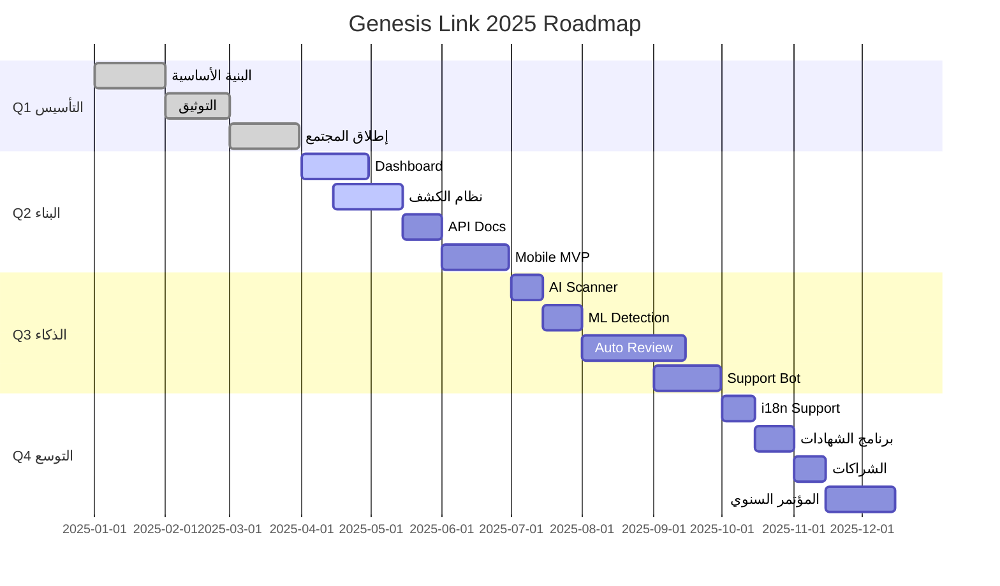

# 🗺️ GENESIS LINK ROADMAP

> **خارطة الطريق الرمزية  درع زايد🇦🇪**  
> نبني المستقبل خطوة بخطوة، بتوقيع كل محارب

---

## 🎯 الرؤية

بناء **نظام دفاع رقمي مجتمعي** يجمع المطورين والباحثين الأمنيين في منصة واحدة لحماية الشبكات وتطوير المهارات.

---

## 📅 الجدول الزمني

### 🚀 المرحلة الأولى: التأسيس (Q1 2025) ✅

**الفترة:** يناير - مارس 2025  
**الحالة:** 🟢 مكتملة

| المهمة | الحالة | المسؤول |
|--------|---------|----------|
| إنشاء البنية الأساسية | ✅ مكتمل | @founder |
| توثيق معايير الأمن | ✅ مكتمل | @security_team |
| إطلاق المجتمع | ✅ مكتمل | @community_lead |
| أول 10 مساهمين | ✅ مكتمل | المجتمع |

**الإنجازات:**
- 🎉 إطلاق المستودع الرسمي
- 📚 4 ملفات توثيقية احترافية
- 👥 تكوين نواة المجتمع

---

### 🔧 المرحلة الثانية: البناء (Q2 2025) 🟡

**الفترة:** أبريل - يونيو 2025  
**الحالة:** 🟡 قيد التنفيذ

| المهمة | الحالة | المسؤول | الموعد |
|--------|---------|----------|---------|
| تطوير Dashboard | 🟡 جاري | @dev_team | 30 أبريل |
| نظام كشف التهديدات | 🟡 جاري | @security_team | 15 مايو |
| API Documentation | ⚪ قادم | @docs_team | 1 يونيو |
| Mobile App (MVP) | ⚪ قادم | @mobile_team | 30 يونيو |

**الأهداف:**
- 🎯 إطلاق لوحة التحكم التفاعلية
- 🔐 تفعيل نظام الكشف الآلي عن الثغرات
- 📱 نسخة تجريبية للتطبيق المحمول
- 📈 الوصول إلى 100 مساهم

---

### 🤖 المرحلة الثالثة: الذكاء الاصطناعي (Q3 2025) ⚪

**الفترة:** يوليو - سبتمبر 2025  
**الحالة:** ⚪ مخطط

| المهمة | المسؤول | الموعد |
|--------|----------|---------|
| AI Security Scanner | @ai_team | 15 يوليو |
| ML Threat Detection | @ml_team | 1 أغسطس |
| Automated Code Review | @automation_team | 15 سبتمبر |
| Chatbot للدعم الفني | @bot_team | 30 سبتمبر |

**الأهداف:**
- 🧠 دمج الذكاء الاصطناعي في الكشف عن الثغرات
- 🤖 تطوير بوت ذكي لمساعدة المساهمين
- 📊 تحليلات تنبؤية للتهديدات

---

### 🌍 المرحلة الرابعة: التوسع العالمي (Q4 2025) ⚪

**الفترة:** أكتوبر - ديسمبر 2025  
**الحالة:** ⚪ مخطط

| المهمة | المسؤول | الموعد |
|--------|----------|---------|
| دعم 10 لغات | @i18n_team | 15 أكتوبر |
| إطلاق برنامج الشهادات | @edu_team | 1 نوفمبر |
| شراكات مع جامعات | @partnerships | 15 نوفمبر |
| مؤتمر سنوي | @events_team | 15 ديسمبر |

**الأهداف:**
- 🌐 الوصول لـ 1000 مساهم من 50 دولة
- 🎓 إصدار 500 شهادة احترافية
- 🤝 10 شراكات أكاديمية
- 🏆 تنظيم أول مؤتمر عالمي

---

## 🎯 الأهداف طويلة المدى (2026+)

### 2026
- 🏢 إطلاق نسخة Enterprise
- 💼 برنامج تدريب الشركات
- 🔬 مختبر أبحاث الأمن السيبراني

### 2027
- 🌟 الوصول لـ 10,000 محارب رقمي
- 🏅 اعتماد دولي للشهادات
- 📖 نشر كتاب "فلسفة الدفاع الرمزي"

---

## 📊 مخطط جانت التفاعلي

---

## 🎖️ كيف تساهم في الخارطة؟

### للمطورين:
1. تصفح [المهام المفتوحة](https://github.com/genesislink/issues)
2. اختر مهمة من المرحلة الحالية
3. ابدأ المساهمة واتبع [`CONTRIBUTING.md`](CONTRIBUTING.md)

### للباحثين الأمنيين:
1. راجع [`SECURITY.md`](SECURITY.md)
2. ابحث عن ثغرات وأبلغ عنها
3. ساهم في كتابة دراسات الحالة

### للمجتمع:
1. انضم إلى [Discord](https://discord.gg/genesislink)
2. شارك في النقاشات الأسبوعية
3. اقترح ميزات جديدة

---

## 📈 مؤشرات الأداء (KPIs)

| المؤشر | Q1 | Q2 | Q3 | Q4 |
|--------|----|----|----|----|
| عدد المساهمين | ✅ 25 | 🎯 100 | 🎯 300 | 🎯 1000 |
| Pull Requests | ✅ 50 | 🎯 200 | 🎯 500 | 🎯 1500 |
| الثغرات المكتشفة | ✅ 5 | 🎯 20 | 🎯 50 | 🎯 100 |
| الجلسات التدريبية | ✅ 12 | 🎯 24 | 🎯 36 | 🎯 52 |

---

## 🤝 الشركاء والداعمون

| الشريك | النوع | الحالة |
|--------|-------|--------|
| 🎓 جامعة القاهرة | أكاديمي | 🟡 قيد المفاوضات |
| 🏢 شركة XYZ | تقني | ⚪ مقترح |
| 🔐 OWASP | مجتمعي | 🟢 نشط |

---

## 💬 التواصل

**للاستفسارات:** roadmap@genesislink.io  
**للاقتراحات:** افتح [GitHub Discussion](https://github.com/genesislink/discussions)  
**للطوارئ:** أبلغ عن [`SECURITY.md`](SECURITY.md)

---

## 📜 تاريخ التحديثات

| التاريخ | الإصدار | التغييرات |
|---------|---------|-----------|
| 2025-01-15 | v1.0 | الإصدار الأولي |
| 2025-03-20 | v1.1 | تحديث Q1 + إضافة مخطط Gantt |
| 2025-04-10 | v1.2 | بدء Q2 + تحديث المؤشرات |

---

**🔱 بني بواسطة المحاربين، للمستقبل 🔱**

[📅 تتبع التقدم](https://github.com/genesislink/projects) | [💡 اقترح ميزة](https://github.com/genesislink/discussions)

